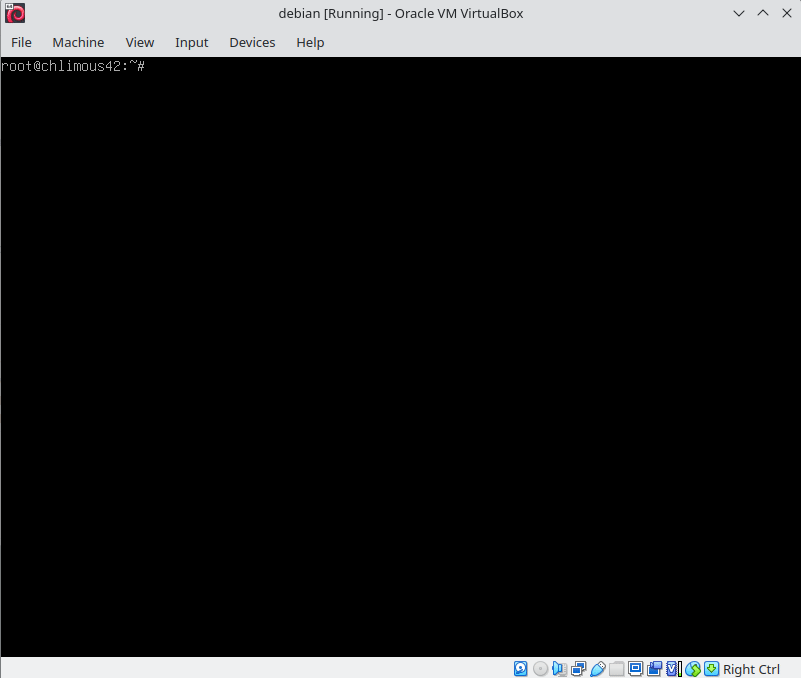
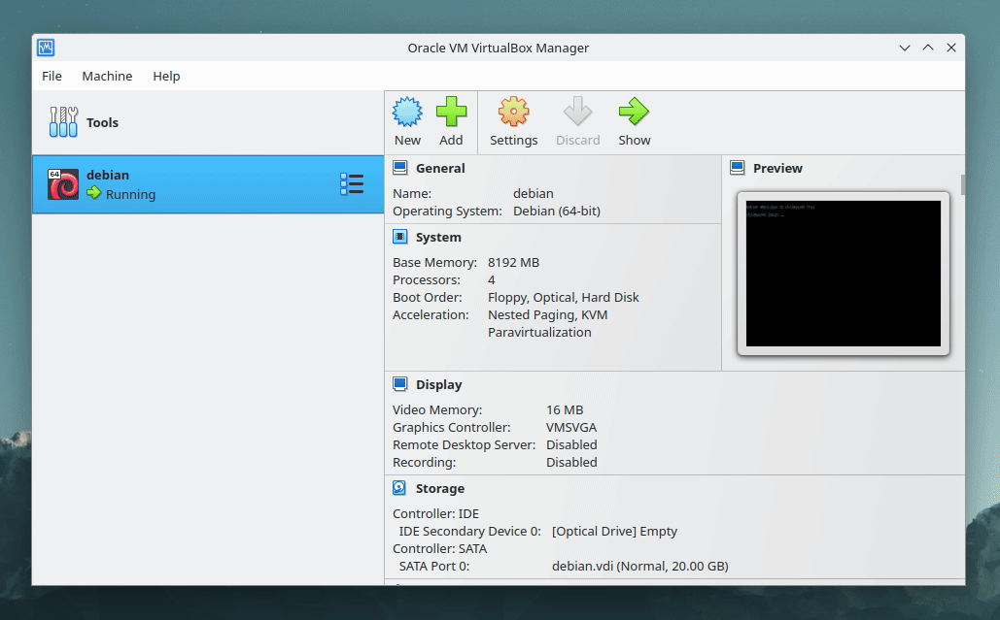
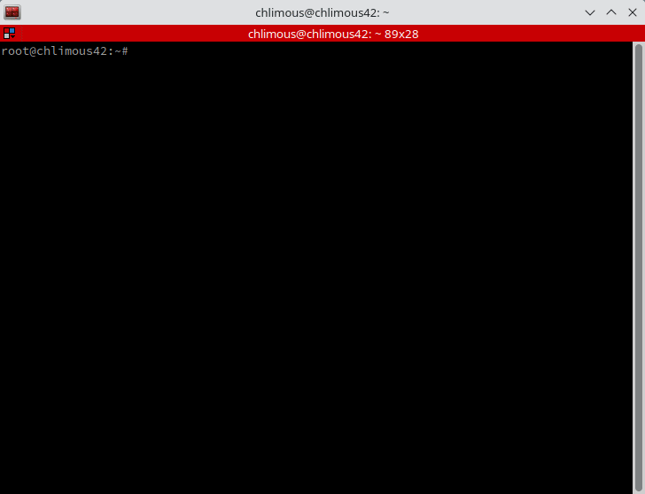
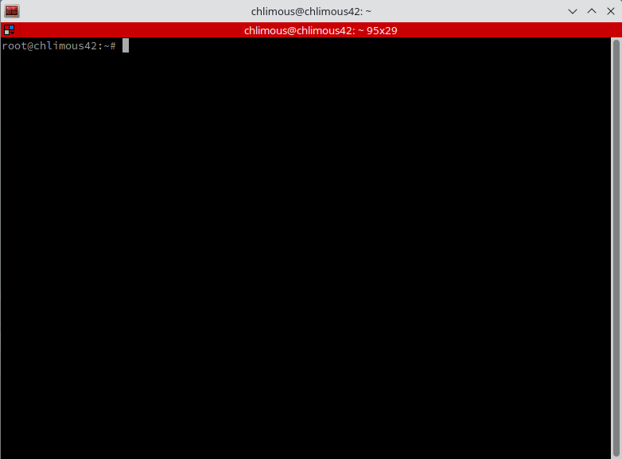

# Born2beroot 42 Guide

## Introduction

Born2beroot aims to introduce you to the world of virtualization and server administration.
In this born2beroot guide, I'll lead you step by step through the whole project, from VM creation and OS installation to services installation and rules implementation.

## Table of Contents

1. [Virtual Machine Creation](#vmcreation)
    1. [Hypervisor](#hypervisor)
    2. [Choosing the Linux Distribution](#choosing-the-linux-distribution)
    3. [Let's begin!](#lets-begin)
2. [Operating System Installation](#operating-system-installation)
    1. [Booting up](#booting-up)
    2. [Partitioning](#partitioning)
3. [Setting up SSH](#setting-up-ssh)
4. [Firewall](#firewall)
5. [sudo and Groups](#sudo-and-groups)
    1. [sudo](#sudo)
    2. [Groups](#groups)
6. [Password Policy](#password-policy)
7. [Monitoring Script](#monitoring-script)
    1. [Writing the script](#writing-the-cript)
    2. [Cron Job](#cron-job)
8. [Setting up Wordpress](#setting-up-wordpress)
    1. [Packages Installation](#packages-installation)
    2. [Firewall and Enabling PHP](#firewall-and-enabling-php)
    3. [Port Forwarding](#port-forwarding)
    4. [Database](#database)
    5. [Putting things together](#putting-things-together)
9. [Additional Service](#additional-service)
    1. [What to choose?](#what-to-choose)
    2. [Setting up Netdata](#setting-up-netdata)
10. [Signature and Snapshots](#signature-and-snapshots)
11. [Miscellaneous](#miscellaneous)

---

### <a name="vmcreation">Virtual Machine Creation</a>

#### <a name="hypervisor">Hypervisor</a>

Firstly, we need a hypervisor to create our virtual machine.

There are two types of hypervisors:

<b>Types 1 (Bare-metal):</b>
These run directly on the host's hardware, facilitating optimized resource allocation. Popular examples include VMWare ESXi, Microsoft Hyper-V and Proxmox. They are used in server enrionments.

<b>Types 2 (Hosted)</b>:
These operate as an additional layer on top of your existing operating system, symplifying the management and accessibility of virtual machines. You will often hear about Virtualbox and VMware Workstation. They are used on PCs.

For this born2beroot guide and as per the project requirements, we will be using Virtualbox, an open source type 2 hypervisor.

#### Choosing the Linux Distribution

You have two options for your Linux distribution: Rocky Linux and Debian. Rocky Linux aims to be the successor to the now-discontinued CentOS, offering a robust and reliable platform for servers. On the other hand, the rock-solid Debian, renowned for its proven stability, also serves as the foundation for Ubuntu.

Given that you are probably new to system administration, Debian is a good choice for both servers and PCs.

#### Let's begin!

First, we need to get the latest ISO image of Debian. You can obtain it from [Debian's official website](https://www.debian.org/distrib/netinst) by selecting "amd64".

Open up Virtualbox and click "New". Name your virtual machine, choose the downloaded ISO image, and select a storage location for the data. If you're at 42 Paris, consider using an external drive or storing it in your sgoinfre, given that your home directory is limited to 5 GB and sgoinfre to 30 GB. Make sure to check "Skip Unattended Installation" before proceeding to the next step.

Now, let's allocate resources to our virtual machine. I recommend allocating at least 4 GiB of RAM and 2 CPU cores, though I used 8 GiB of RAM and 8 CPU cores for better performance.

For storage, 10 GiB should suffice, but I opted for 20 GiB. Check "Pre-allocate Full Size".

---

### Operating System Installation

#### Booting up

Now that our virtual machine is ready, the next step is to install the operating system, much like you would on a regular conputer.

Click "Start" on your Virtualbox interface. Select "Install" and then follow the on-screen instructions. The installation process is quite straightforward, especially when compared to more complex distributions like Arch or Gentoo. If you've ever tried installing those, you'll find Debian notably easier.

Set the hostname as your login followed by 42, as required by the project guidelines. This is the name of your device on the local network.
Skip domain name configuration. Set a password for root. Make a user with your login and set a password for this account.

#### Partitioning

It's time to partition our disk. Select "Guided - use entire disk and set up encrypted LVM" then select "Separate /home, /var and /tmp partitions". This setup is crucial for completing the bonus part of born2beroot.

Set a password. With this, even if the police raid my home, they won't get to my data unless they break my (super weak) password. 🥸

Adjust the volume group size in guided partitioning to carve out space for a couple more logical volumes.
Head over to "Configure the Logical Volume Manager", and make two logical volumes: ``srv`` and ``var-log``.
Set them both as "Ext4 journaling file system" and mount them respectively to ``/srv`` and ``/var/log``.

Avoid scanning for extra installation media. Select the default Debian archive mirror and leave the proxy settings blank. Choose not to participate in the package usage survey. Ensure to install the GRUB loader.

Finally, when it comes to software selection, only select "SSH server" and "standard system utilities". Use space to check/uncheck. And just like that, we're done installing. Give your virtual machine a quick reboot to start exploring the rest of this born2beroot guide.

---

### Setting up SSH

We can now log into the server, but what if we want to access it remotely? It's time to set up SSH.

Log in as root and check the SSH service status: ``systemctl status ssh``

The output should show that the SSH service is active and running on the default port 22. Born2beroot requires us to run the SSH server on port 4242. To do this, edit the SSH configuration file located at ``/etc/ssh/sshd_config``. Use your preferred text to open the file. Change ``Port 22`` to ``Port 4242`` and set ``PermitRootLogin`` to ``no``. Remember to uncomment the lines after making changes.

Once done, restart SSH with: ``systemctl restart ssh``

Next, set up port forwarding in Virtualbox:

Go to your virtual machine's settings, navigate to Network, then Advanced, and finally Port Forwarding.
Create a new rule named "SSH". This rule should redirect an available host port to the guest port 4242. At 42 Paris, port 22 is unavailable, so I used port 2222 as host port.

With port forwarding set up, Virtualbox listen for requests on port 2222 of the host machine and then forwards these requests to port 4242 of the guest machine. This allows for SSH access to the virtual machine from the host system.

With these steps completed, you should now be able to connect to your virtual machine via SSH.

Log out of the virtual machine: ``logout``

Then, on your host terminal, type:

``ssh chlimous@localhost -p 2222`` | Connects the user ``chlimous`` to the ``localhost`` machine on port ``2222`` via SSH.

---

### Firewall

Once you are logged into SSH, switch to the root user by typing: ``su -``

To enhance the server's security, we'll set up a firewall using UFW (Uncomplicated Firewall). UFW is user-friendly and effective for managing firewall rules. Let's start by installing UFW:

``apt install ufw`` | Installs UFW.

``ufw default deny incoming`` | Blocks all incoming requests.

``ufw default allow outgoing`` | Allows all outgoing requests.

``ufw allow 4242`` | Allow incoming traffic on port ``4242``. tThis is crucial to ensure you can still access your server via SSH.

``ufw enable`` | Enables UFW.

---

### sudo and Groups

### sudo

The sudo program is a crucial tool for Linux, allowing users to execute commands with privileges of root (or another user).

To install, type: ``apt install sudo``

Now, we'll adjust the sudo settings. Type ``visudo`` to open the configuration file.

Add the following lines:

``Defaults secure_path="/usr/local/sbin:/usr/local/bin:/usr/sbin:/usr/bin:/sbin:/bin"`` | Limits the paths that can be used by sudo to run commands. This setting is already there and you can leave it as it is.

``Defaults requiretty`` | Requires TTY to use sudo.

``Defaults badpass_message="WRONG PASSWORD"`` | Displays a custom message when using a wrong password with sudo.

``Defaults log_input`` | Logs input.

``Defaults log_output`` | Logs output.

``Defaults iolog_dir=/var/log/sudo`` | Sets the directory to save logs.

``Defaults passwd_tries=3`` | Limits connection attempts using sudo.

### Groups

We need to add our user to the ``user42`` and ``sudo`` groups as specified in the born2beroot requirements.

``groupadd user42`` | Adds the ``user42`` group.

``usermod -a -G user42,sudo chlimous`` | Adds the ``chlimous`` user to the ``user42`` and ``sudo`` groups.

To verify the changes, you can check the ``/etc/group`` file: ``cat /etc/group``

Now that your user has been added to the sudo group, he can execute commands using ``sudo``, elevating his permissions to perform administrative tasks.

---

### Password Policy

Go to the /etc/login.defs configuration file and modify the following lines:

``PASS_MAX_DAYS 30`` | Makes the password expire every 30 days.

``PASS_MIN_DAYS 2`` | Minimum number of days before the modification of a password.

``PASS_WARN_AGE 7`` | Number of days warning given before a password expires. You can leave it as it is.

Now we need to ensure the policy changes we've made are applied to our current users:

``chage -M 30 chlimous`` | Sets ``PASS_MAX_DAYS`` to ``30`` days for user ``chlimous``.

``chage -m 2 chlimous`` | Sets ``PASS_MIN_DAYS`` to ``2`` days for user ``chlimous``.

Apply these changes for both your user account and the root account.

To strengthten the password policy, we will utilize a module called pwquality:

``apt install libpam-pwquality``

Then, access ``/etc/pam.d/common-password`` configuration file to set the password rules.

Change:

``password requisite pam_pwquality.so retry=3``

to:

``password        requisite                       pam_pwquality.so retry=3 minlen=10 difok=7 maxrepeat=3 dcredit=-1 ucredit=-1 lcredit=-1 reject_username enforce_for_root``

Details:

``retry`` | Maximum amount of incorrect attempts.

``minlen`` | Minimum acceptable size for the new password.

``difok`` | Number of characters in the new password that must not be present in the old password. Even with enforce_for_root, this rule doesn't apply to the root user since the old password is not required to change it.

``maxrepeat`` | The maximum number of allowed same consecutive characters in the new password.

``dcredit`` | Minimum number of digits in the new password. (negative value)

``ucredit`` | Minimum number of uppercase characters in the new password. (negative value)

``lcredit`` | Minimum number of lowercase characters in the new password. (negative value)

``reject_username`` | The new password cannot include the username.

``enforce_for_root`` | Applies rules to root.

With the new rules enforced, update the passwords for both your user account and the root account:

``passwd chlimous`` | Changes the password of the ``chlimous`` user.

---

### Monitoring Script

#### Writing the cript

[You can check my script](monitoring.sh), but I will not cover this part. RTFM 🤓

To make it work, you need ``bc`` and ``sysstat``:

``apt install bc sysstat``

#### Cron Job

The cron program allows you to run scripts automatically in the background based on a set schedule.

To add a cron job, edit the crontab file as root:

``crontab -e`` | In this file, each line represents a cron job.

``*/10 * * * * bash /etc/cron.d/monitoring.sh | wall`` | Every 10 minutes, ``cron`` will execute the ``monitoring.sh`` script located in ``/etc/cron.d`` and pipe the output to ``wall``.

---

### Setting up Wordpress

With the mandatory part behind us, let's now turn our attention to the bonus.

#### Packages Installation

To run Wordpress, a web server, a database management system, and PHP are required.

``apt install lightppd`` | lighttpd, a super light web server.

``apt install mariadb-server`` | MariaDB, a fork of MySQL.

``apt install php php-pdo php-mysql php-zip php-gd php-mbstring php-curl php-xml php-pear php-bcmath php-opcache php-json php-cgi`` | PHP main and additional packages.

#### Firewall and Enabling PHP

To enable PHP on the web server, type this command:

``lighttpd-enable-mod fastcgi fastcgi-php``

Following this, restart the web server to apply the changes with: ``systemctl restart lighttpd``

Also, recall the firewall settings we discussed earlier? Currently, it only permits incoming requests on port 4242. To accommodate HTTP requests, we need to open port 80.

``ufw allow http``

#### Port Forwarding

Once again, we need to set up port forwarding in Virtualbox.

Establish a port forwarding rule that redirects requests from any available port on the host to guest port 80.

Your web server should now be accessible at [127.0.0.1:1672](http://127.0.0.1:1672) (replace 1672 with chosen host port).

#### Database

Access the mariadb prompt by typing ``mariadb``

Then, type this:

``CREATE DATABASE chlimous_db;`` | Creates the ``chlimous_db`` database.

``CREATE USER chlimous@localhost;`` | Creates the user ``chlimous`` and restricts his access to connect to the database solely from ``localhost``.

``GRANT ALL PRIVILEGES ON chlimous_db.* TO chlimous@localhost;`` | Gives complete permissions to the user ``chlimous`` on the ``localhost`` host for all tables in the database ``chlimous_db``.

``FLUSH PRIVILEGES;`` | Updates permissions.

#### Putting things together

There is one element left to add: Wordpress.

Move to ``/var/www/html/``, the root of your web server. Delete any existing files in this directory: ``rm *``

``wget https://wordpress.org/latest.tar.gz`` | Downloads the latest version of Wordpress.

``tar xvf *.tar.gz && rm *.tar.gz`` | Unpacks the archive and deletes it.

``mv wordpress/* . && rm -r wordpress`` | Moves Wordpress files to the root directory and deletes the empty Wordpress directory.

``chown -R www-data:www-data /var/www/html/`` | Changes the ownership of the ``/var/www/html/`` directory to ``www-data``. This step is necessary for the web server to function properly.

Return to [127.0.0.1:1672](http://127.0.0.1:1672). You can now access Wordpress, but first, you need to configure database access. The installation process is straightforward: simply select your language, then enter the database name and user credentials. Your website is ready to go.

---

### Additional service

#### What to choose?

The possibilities for hosting services are limitless.

Here are a few suggestions to get you started:

- Generative AI (Stable Diffusion)
- Monitoring (Prometheus/Grafana)
- Finance (Ghostfolio)
- ERP/CRM (Odoo)
- Blockchain (Node)
- Media Server (Jellyfin)
- Game Server (Minecraft)
- NAS (Nextcloud)
- Translation (LibreTranslate)
- Analytics (Matomo)
- Speedtest (LibreSpeed)
- Containers Utility (Docker)
- Hosting Panel (Cloudron)
- Automation (Automatisch)
- IDE (Visual Studio Code Server)
- Social Platform (Revolt)
- Chat (Rocket.Chat)
- Pastebin (Hastebin)
- VPN (OpenVPN)
- VOIP (Teamspeak)
- Notes (Standard Notes)
- Git Server (Gitlab)
- Forum (Discourse)

... and the list goes on.

#### Setting up Netdata

I opted for Netdata, an open source monitoring service in the vein of Prometheus/Grafana.

``apt install netdata``

Netdata operates on port 19999, so you'll need to open this port: ``ufw allow 19999``

It is already enabled on startup, you can check it by typing: ``systemctl is-enabled netdata``

Lastly, set up port forwarding from any unused host port to the guest port 19999. By this point, you should be familiar with how it works! I used 1372 as the host port.

You may need to change the IP address to 0.0.0.0 in the ``etc/netdata/netdata.conf`` file.

With these settings, Netdata should now be reachable at [127.0.0.1:1372](http://127.0.0.1:1372)

---

### Signature and Snapshots

Last but not least of this born2beroot guide, you have to generate the hash of your .vdi file. This ensures that your virtual machine remains unchanged between the project's closure and subsequent evaluations.

First, shut down your guest machine and take a snapshot of it in Virtualbox. This step enables you to revert to the exact state captured in the snapshot at any time, regardless of any significant changes made to your system thereafter. Be sure to use this snapshot before each evaluation.

Navigate to the directory containing your virtual machine.

``sha1sum debian.vdi`` | Generates the SHA-1 hash for the ``debian.vdi`` file.

Be aware that this process might take a long time. The larger your virtual disk size, the longer it will take to generate the hash signature.

### Miscellaneous

Under construction
